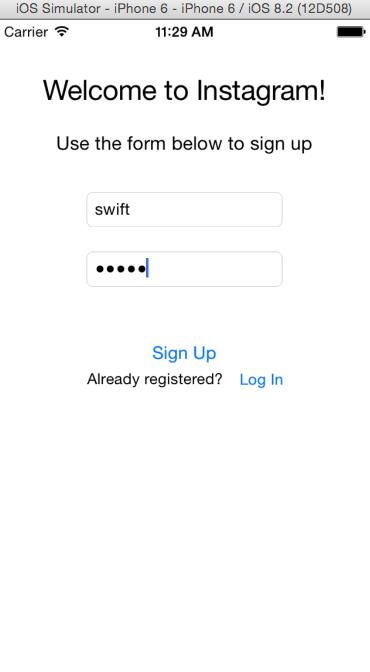
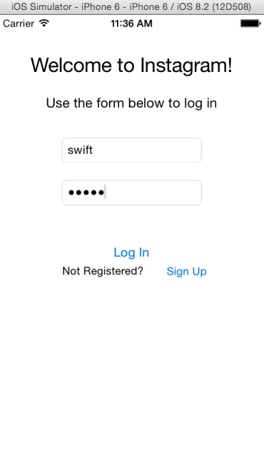
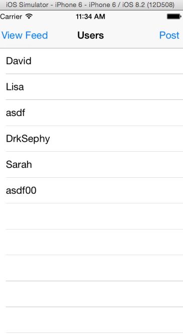
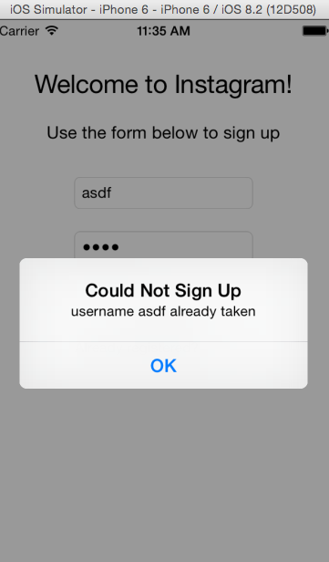
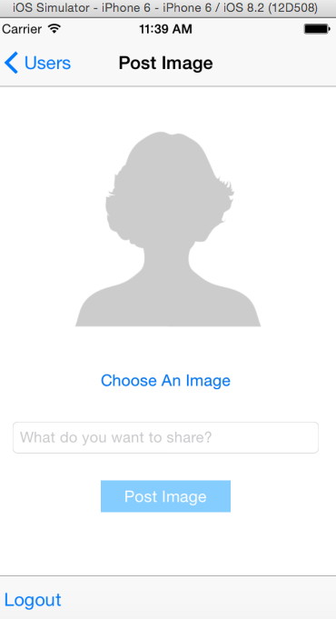
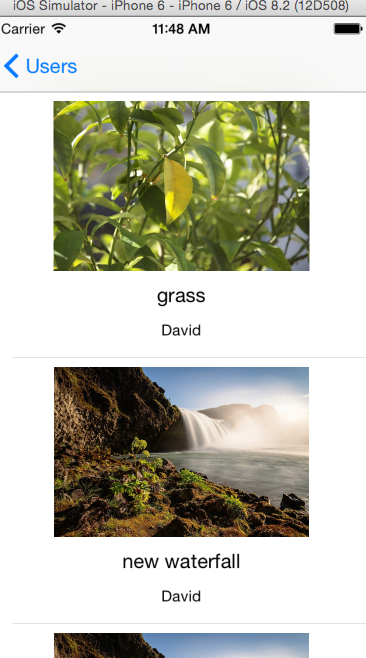

# Instagram Clone

An iOS Instagram clone built using Swift. This project has been quite a learning experience - dealing with multiple types of segues, user interfaces, and balancing multiple Table View Controllers, as well as learning to use the extremely powerful [Parse backend](https://parse.com/). This application contains the following features:

* Dual Login/Sign Up views using Booleans to manipulate layout. Remember, [stay dry]( http://en.wikipedia.org/wiki/Don%27t_repeat_yourself)!
* Custom classes to override the base `cell prototype` class provided by `TableViewController`. This is to control the contents of each cell individually on the `image feed`, as opposed on the page level. 
* Extensive use of the [Parse backend](https://parse.com/), which was used for storing users, passwords, images, followed/following and all post content.
* Ability to allow the user to select an image from their camrera roll using the ` UIImagePickerControllerDelegate` class.
* Customized error messages for a rich user experience.
* Filtering on the `image feed` so only content of users that the particular logged in User is following.
* `Pull to Refresh`, implemented using the `UIRefreshControl` class which allows the user to drag the screen down to refresh content. Useful if there are many images on the user feed to download due to slow connections. 

On startup, the user is prompted by the `Sign Up` screen: 

Here, the user may input a `username` and `password`. By clicking `Sign Up`, the user will be registered within the `Parse` backend and stored within a `User` table. A succesful signup will _automatically segue_ the user to the _users_ view, where a list of all users of the application is displayed. 

Instead of repeating the same code and writing a separate view for logging in, I went with a more concise approach of using Booleans to determine whether the user is signing up or logging in, which updates the text labels and buttons appropriately. 

Upon succesful login/signup, the user is automatically segued to the user table.

If a `username` is already taken, the user is presented with the following error message:

On the `Users` view, a list of all users of this application is shown. The user can now tap a user to begin to `follow` them, and subsequently tap again to `unfollow`. 

By tapping `Post` on the upper-right hand corner, the user is presented with this view:

Where they can select an image from their camera roll, supply a title and some text to post the image up. Once the 'Post Image' button has been tapped, a nice spinning alert is displayed while the data is being saved to the `Parse backend`, and disappears when finished. 

Finally, the user may select `View Feed` to see all images posted by users they are currently following. 

Code to query the Parse backend to only retrieve users in which the current logged in User is following was written to only show followers contents. A custom `cell` class was written to individually handle each cell, which isn't possible at the `page` level of the application. 
