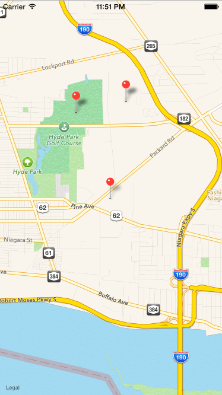

# Map Demo

A iOS demo app for experimenting with maps. The user can add a pin by long-pressing for 2 seconds on a location.

# Notes

To add a library to your application, click on the project name on the top left in the file list, `build phases` -> `Link Binary with Libraries` -> `+`. 

This map demo uses the `CoreLocation.framework` library to ask for the User's location.

To prompt the user for this information, we edit `info.plist` under `Supporting Files` as follows:

* Add a new key, `NSLocationWhenInUseUsageDescription`, along with any value representing the message that will prompt the user for their location. This is used when the app is running. 

To get the user's location whenever needed and the app is running in the background, we add the following key, value pair:

* `NSLocationAlwaysUsageDescription`, along with a value for the message to prompt the user for their location.