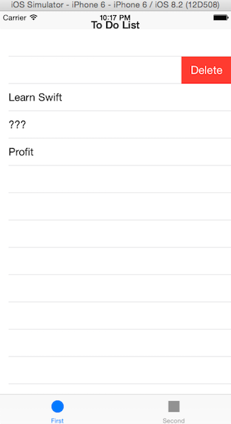
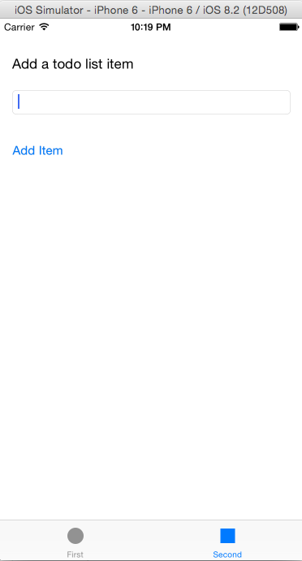

# To Do List

A To Do List iOS application with the following features:

* Uses `NSUserDefaults` to store the items entered permanently. 
* Implements ability to swipe left by checking `editingStyle == UITableViewCellEditingStyle.Delete`, allowing the user to delete items. 
* Allows the user to enter items using the `Second View Controller`. 
* By using `NSUserDefaults`, the data will persist even when the application is closed down.

The main screen:

Option to delete by swiping left:

Screen to add items to the list:

